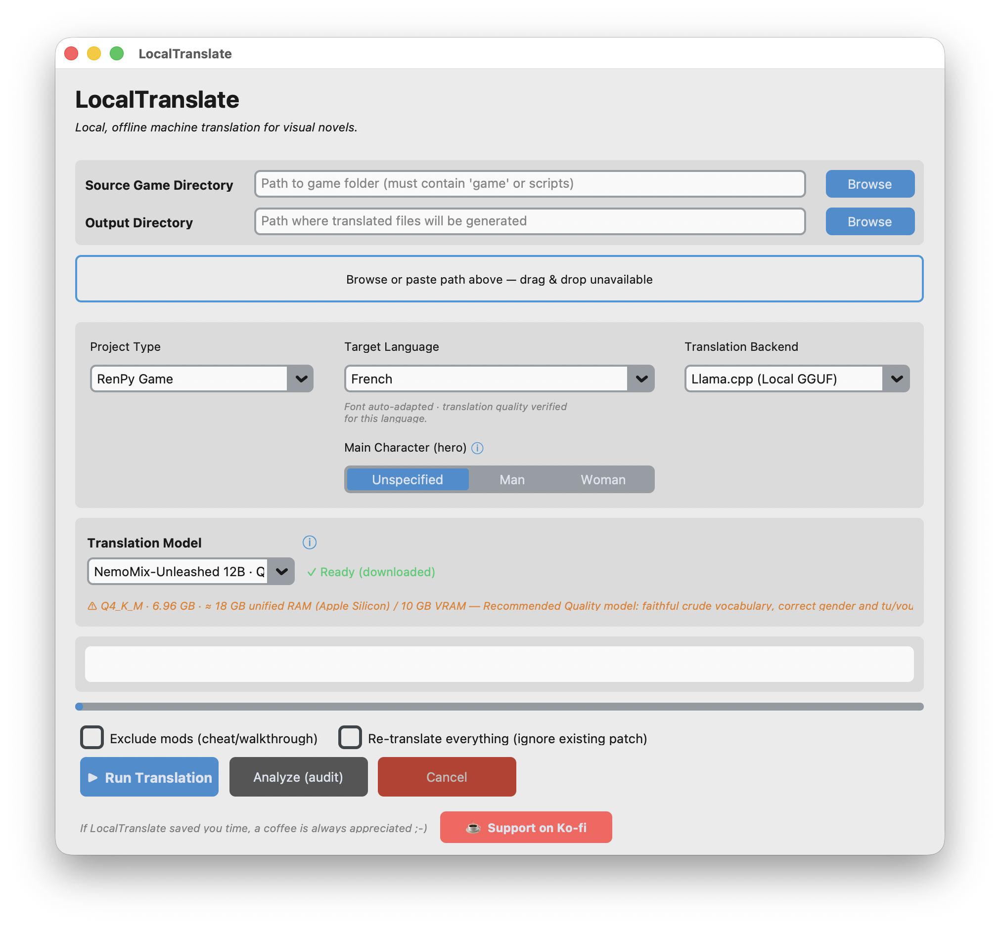

# LocalTranslate

**Translate Ren'Py visual novels with a local LLM — 100% offline, no data ever leaves your machine.**

[](https://github.com/Engue123/LocalTranslate/actions/workflows/ci.yml)
[](LICENSE)
[](https://www.python.org/)
[](https://ko-fi.com/G3D422PBO3)

> ⚠️ **Experimental project.** LocalTranslate is an independent, experimental tool
> built to help the Ren'Py community translate games locally. It is offered as-is,
> in the hope that it is useful.

---

## What it is

LocalTranslate is a desktop application (GUI + CLI) that produces a **French (or other
language) translation patch** for a Ren'Py game using a **local, quantized LLM** run
through `llama-cpp-python`. Everything happens on your computer — only the one-time model
download needs Internet.

It reads the game's compiled scripts, extracts every translatable line with **engine-exact
identifiers**, translates them with the model of your choice, and writes a clean
`tl/<language>/` patch you drop into the game.

## 📸 Screenshots



## 🛡️ Safety — read-only by design

**LocalTranslate never modifies your game's original files.**

- It **reads** the game's scripts and archives (`.rpy`, `.rpyc`, `.rpa`) — nothing more.
- It **writes only** to an output folder you choose, producing a standard Ren'Py
  `game/tl/<language>/` language patch plus turnkey install instructions.
- You install the patch yourself by copying it into the game. The original game is
  untouched, so **there is no risk of breaking it** — and you can remove the patch at any time.

## ✨ Features

- **Fully offline** local translation (GGUF models via `llama-cpp-python`).
- **AST-exact extraction** of dialogue, menu choices and UI strings.
- **Two model tiers** you can switch between:
  - a small, fast, universal machine-translation model;
  - a larger instruction-following model for gender/register control and faithful adult content.
- **Grammatical gender control** (declared main character, inferred cast, addressed listener).
- **Guaranteed markup safety** — Ren'Py tags/variables are always preserved (see below).
- **Automatic font adaptation** — if the game's font can't draw the target language
  (accents, Cyrillic, CJK…), a covering font is shipped with the patch so the text renders.
- **Delta mode** — completes an existing partial patch, translating only what's missing.
- **In-game language switcher** and post-run quality report generated automatically.
- **Graphical and command-line** interfaces.

## 🧠 Quality & the challenges behind it

Machine-translating a game engine's scripts is not "run text through a model." Three
problems had to be solved for the output to actually work in Ren'Py:

- **AST-pivot extraction for perfect identifiers.** Ren'Py binds each translation to an
  identifier derived from the *compiled* script (`.rpyc`), which can drift from the `.rpy`
  text. LocalTranslate loads the compiled AST and computes those identifiers exactly the
  way the engine does, so translations always bind to the right line.
- **The "Markup L5" guarantee.** Dialogue is full of engine markup (`{i}`, `{color}`,
  `[player_name]`, …). Every line is masked, translated, restored and **validated**; if the
  markup can't be preserved, the line is retried, then handed to the fast machine-translation
  model, and only as a last resort kept in the source language — **the patch can never emit
  broken Ren'Py markup.**
- **Deterministic French post-editing.** After translation, a rule-based pass fixes French
  elision (e.g. *"te endors"* → *"t'endors"*), safely and predictably, without a model.

## 🌍 Languages

The architecture is **language-agnostic** (source → target is fully parameterised, and a
localized font is shipped whenever the game's own font lacks the target script). However,
**the tool has only been deeply tested from English into French, on real commercial games.**

Other targets (Spanish, Italian, German, Portuguese, Russian, Japanese, Chinese, Korean)
are supported by the pipeline and produce the correct script, but their translation quality
has not been validated by the author — community feedback is very welcome. Because the model
is a drop-in GGUF file, you can swap in one better suited to your language.

## 💻 Installation & hardware

### Requirements

- **Python 3.10+**
- A local GGUF model (downloaded automatically on first run — see below)
- Hardware depends on the model tier:

| Model tier | File size | RAM | GPU / VRAM | Speed |
|---|---|---|---|---|
| **Universal (Q6, ~1.8B)** | ~1.4 GB | ~4 GB | optional (CPU is fine) | fast |
| **Quality (12B, Q4)** | ~7 GB | ~18 GB | ~10 GB VRAM recommended | slower |

The Quality tier runs on CPU too, but is much faster with a GPU.

### 1. Get the code and dependencies

```bash
git clone https://github.com/<your-username>/LocalTranslate.git
cd LocalTranslate
python -m venv .venv
source .venv/bin/activate        # Windows: .venv\Scripts\activate
pip install -r requirements.txt
```

### 2. Install `llama-cpp-python` for your hardware

`llama-cpp-python` is the local inference engine. Pick the build that matches your GPU:

- **macOS (Apple Silicon — Metal):** the default install already builds with Metal.
  ```bash
  pip install llama-cpp-python
  ```
- **Windows / Linux with an NVIDIA GPU (CUDA):** install a CUDA build.
  ```bash
  CMAKE_ARGS="-DGGML_CUDA=on" pip install llama-cpp-python --no-cache-dir
  ```
  (or use a prebuilt CUDA wheel from the project's releases).
- **CPU only (any OS):** the default install works everywhere, just slower.
  ```bash
  pip install llama-cpp-python
  ```

> Check your setup at any time with:
> ```bash
> python scripts/check_env.py
> ```

### 3. Run

**macOS — one command does everything** (checks Python/Tkinter, creates the
virtualenv, installs dependencies, fetches the universal model, runs the tests,
then opens the GUI):

```bash
./launch.sh
```

**Any platform** (after the manual install above):

```bash
python main.py                 # launches the graphical interface
# or, headless:
python main.py --cli --source /path/to/game --output /path/to/output \
               --backend llama --model q6 --tgt-lang fr
```

The chosen model is **downloaded once** (via `urllib`) into a local `models/` folder that
is git-ignored, then used fully offline.

### Platform support

- **macOS** — tested and validated (the reference platform).
- **Windows / Linux** — compatible by design (portable paths, no OS-specific commands),
  but **not yet validated in practice**. Reports and fixes are welcome.

## 📦 Installing a generated patch

After a run, the output folder contains a `game/tl/<language>/` patch and an
`INSTALL_INSTRUCTIONS.md`. Copy the `game/tl/<language>/` folder into the target game's
`game/` directory, launch the game, and pick the language from the in-game menu.

## 🤝 Contributing

Issues and pull requests are welcome — see [CONTRIBUTING.md](CONTRIBUTING.md). The core is
covered by an extensive test suite (`pytest`); please keep it green.

## 📄 License

Released under the **MIT License** — see [LICENSE](LICENSE). Any use, modification or
distribution must keep clear attribution to the original author,
**Enguerrand Derbaudrenghien**.

## ☕ Support

If LocalTranslate saved you time, a coffee is always appreciated:
**[ko-fi.com/G3D422PBO3](https://ko-fi.com/G3D422PBO3)** — thank you!

[](https://ko-fi.com/G3D422PBO3)


